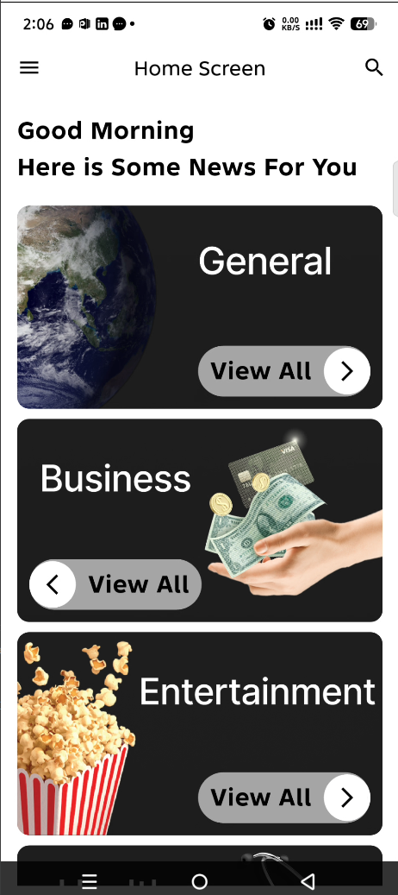
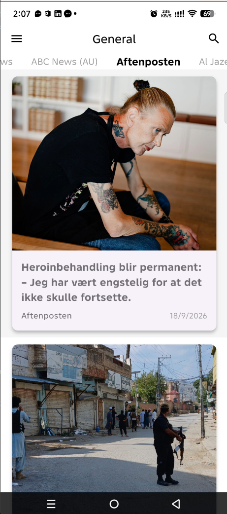
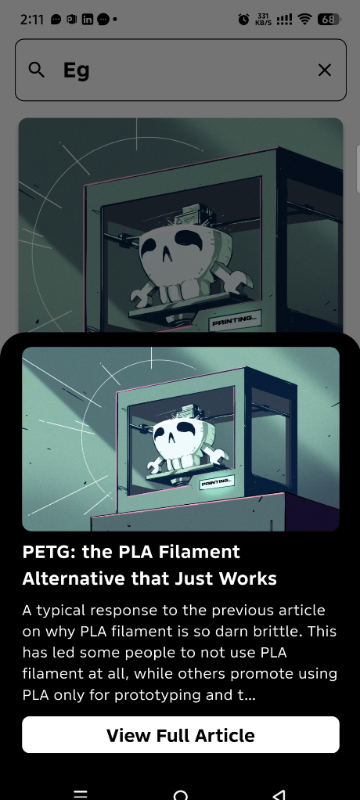
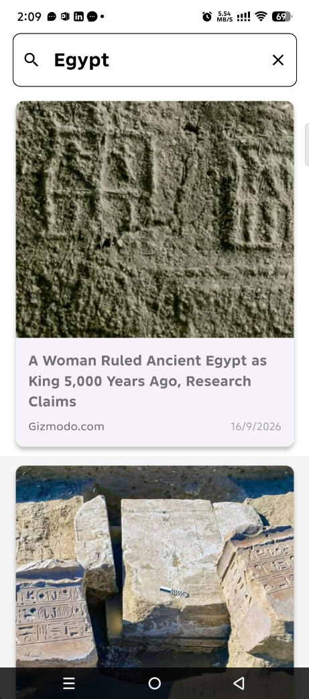

# News App

A Flutter news reader that helps people move from category discovery to publisher feeds, topic search, and the original article without losing context.

Built as an independent mobile project, the app uses a simple MVVM structure and Provider-based state updates to keep the UI, view model, data models, and API client clearly separated.

## Product highlights

- Browse a category-led home screen for General, Business, Entertainment, Health, Science, Sports, and Technology news.
- Select a publisher/source within a category before opening its latest stories.
- Search NewsAPI content by topic.
- Preview an article in a bottom sheet, then open the publisher's full article in an in-app browser.
- Keep the reading action above the device navigation area through safe-area-aware bottom-sheet layouts.

## Screens

<p align="center">
  
  
  
  
</p>

## Reader flow

```text
Home categories
  -> Available sources
  -> Article feed
  -> Article preview
  -> Publisher article in an in-app browser

Search query
  -> Matching articles
  -> Article preview
  -> Publisher article in an in-app browser
```

## Architecture

The project follows a lightweight MVVM arrangement:

```text
lib/
├── Core/                         # Shared assets, theme, and reusable widgets
├── network/                      # NewsAPI endpoint constants and HTTP requests
└── UI/
    ├── HomeScreen/
    │   ├── Home_viewModel/       # ChangeNotifier state and screen actions
    │   ├── DetailCategory/       # Source and article browsing flow
    │   ├── model/                # API response models
    │   └── search/               # Topic search flow
    └── splashScreen/
```

`HomeviewModel` owns the presentation state and notifies the UI through Provider. The `network` layer uses `http` to request NewsAPI sources, category articles, and search results.

## Tech stack

| Area | Tools |
| --- | --- |
| Mobile | Flutter, Dart, Material UI |
| Architecture | MVVM, Provider / ChangeNotifier |
| Data | NewsAPI, REST, `http` |
| External article handoff | `url_launcher` in-app web view |
| UI feedback | Lottie |

## Run locally

### Prerequisites

- Flutter SDK
- Android Studio or VS Code with a connected emulator/device
- A [NewsAPI](https://newsapi.org/) API key

### Setup

```bash
git clone https://github.com/Abdallahkhale/new-app.git
cd new-app
flutter pub get
flutter run --dart-define=NEWS_API_KEY=your_newsapi_key
```

For a release APK:

```bash
flutter build apk --dart-define=NEWS_API_KEY=your_newsapi_key
```

The API key is deliberately supplied at build time and is not committed to the repository. Never add a real key to source code or push it to GitHub.

## Portfolio case study

See the product presentation, screen gallery, and implementation summary in the [News App case study](https://abdallah-khaled-flutter.vercel.app/projects/news-app).

## Author

**Abdallah Khaled Gadalla**<br />
Flutter Developer | [LinkedIn](https://www.linkedin.com/in/abdallahkhaled2/) | [Portfolio](https://abdallah-khaled-flutter.vercel.app/)
